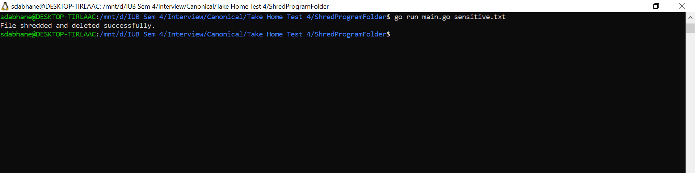
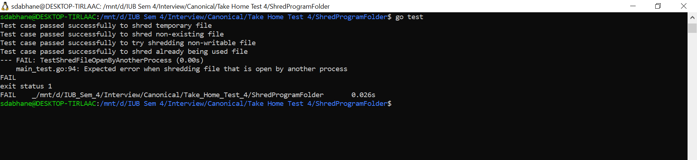

# Implementation of Shred function:

Run the main.go program with the Shred tool for a sample file called "sensitive.txt".

# Implementation of Test Cases:

## Possible Test Cases of Shred Tool

1. Valid path to a file that contains data - should overwrite and delete the file.
2. Valid path to an empty file - should still perform overwrites and then delete.
3. Invalid path or non-existent file - should return an error.
4. Path to a directory instead of a file - should return an error.
5. Files with different sizes - to check how the function behaves with different sized files.
6. File with read-only permissions - should return an error.
7. File which is already being used - should return an error. 

## Implemented Test Cases:

1. Shred a file which has a valid path and data - should overwrite and delete the file
2. Shred a file which has invalid path or non-existent file - should return an error
3. Shred a file with read-only permissions - should return an error
4. Shred a file which is already being used

# Use Cases for Shred Function:
This tool can be used when:

1. Ensuring sensitive data is deleted to prevent easy recovery.
2. Clearing storage space while making sure prior data remains hard to retrieve.

# Advantages:

1. The Shred tool enhances security measures when deleting files.
2. The Shred tool utilizes cryptographic random numbers for overwriting content.
   
# Drawbacks:

1. Tripling overwrites may not adequately secure highly sensitive data; certain standards suggest numerous passes using diverse data patterns.
2. Mismanages files larger than 1024 bytes, only addressing the initial 1024 bytes and neglecting the remainder.
3. File systems using wear-leveling (e.g., certain SSDs) may not target the exact physical storage sectors, risking the preservation of the initial data.
4. Simply erasing a file doesn't confirm its removal from backups, cloud synchronizations, or other duplicate locations.
5. The process can be slow for larger files because of repeated overwriting cycles.

